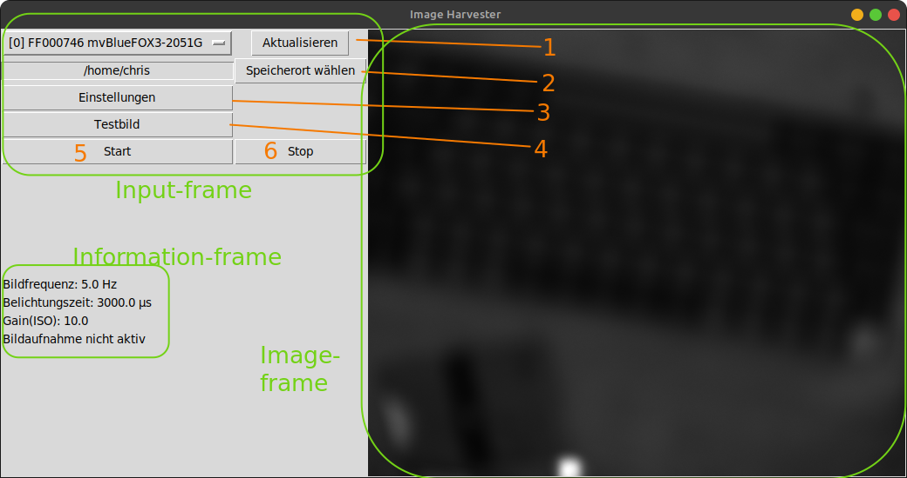
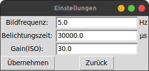

# Important information

- The language of the GUI is german
- It is written on a Linux-based system and not tested on other OS.
- Uses the [MatrixVision SDK](https://www.matrix-vision.com/manuals/SDK_PYTHON/index.html)
- python version 3.8

## Task

HMI to connect to a linked Camera from MatrixVision, to make changes on some settings, get images and save them to a given path.
The currently used camera in the field is mvBlueCOUGAR-X105bG
For testing the Software I got a mvBlueFOX3-2051G.

## Parameters which can be set (with device specific default settings):

1. FrameRate (Frequenz mit der Bilder aufgenommen werden)
   BlueFox3: 5450 Hz

2. Exposure Time
   BlueFox3: 20000 us (Microseconds)

3. Gain
   BlueFox3: 0 absolute physical value!

4. Trigger
   There are free lines on the camera which can be used to send a trigger signal. For example to trigger an external light source. (see _config.ini_)

# How to use

## How to run the code

clone the repository to a directory (dirpath) of your choice

<!-- prettier-ignore -->
1.     $ cd dirpath 
2.     $ git clone https://github.com/chriMay/Image_Harvester.git
Change to Image_Harvester and run the main.py in the terminal

3.     $ cd dirpath/Image_Harvester
4.     $ python3 main.py
Or give the file the the right to execute and run it by double-clicking main.py in the windows-manager

4.     $ chmod +x main.py

## Enduser-Usage of Image-Harvester

There is a main-window and a subwindow for the settings.

### Main-Window

1. At the top you can choose between the cameras linked to the PC. If you link devices to the PC after starting the _Image Harvester_ they won't show up. Therefore you has to press the _Aktualisieren_-Button. If you face unusual behavior for example after disconnecting a device and pressing _Aktualisieren_ afterwards, you may have a look at the **Further information for developers** section.

2. In this row you can see the current path where the images should be stored. With the button _Speicherort wählen_ you can change the path.

3. In the next row you can choose the path where the images will be stored
   With the Button _Einstellungen_ the **Settings-Window** (see section below) will pop up.

4. With the button _Testbild_ you can make a test image to check if your settings are correct and the device points in the right direction.

5. Pressing the _Start_-button starts the Harvesting Process of the images. If its active an information (Bildaufnahme aktiv) is displayed on the _Information-frame_. A folder will be created which is named in the format _YYYY-MM-DD_hh-mm_. The images are stored in this folder and named after the timestamp when they were taken. If there is not device found an information is displayed on the _Information-frame_.

6. Pressing the _Stop_-button stops the Harvesting Process.

### Settings-Window

  
In this window the frame-rate (_Bildfrequenz_), exposure-time(_Belichtungszeit_) and the gain (_Gain(ISO)_) can be changed. The button _Übernehmen_ overwrites the default-settings in the _config.ini_ file. The current settings are displayed in the _Information-frame_ of the **Main-Window** (see section above).  
**Notice:** With every start of the program the settings change back to the default-settings from the _config.ini_ file.

## Config-file (_config.ini_)

If you use some settings very often you can change the default-settings in the config-file. Therefore just overwrite the values for the parameter you want to change.  
**Important info about parameters:**

- FrameRate
  Unit: Hz

- ExposureTime
  Unit: µs (Microseconds)

- Gain
  Unit: absolute value (for more information see [mvIMPACT Acquire SDK Manual](https://www.matrix-vision.com/manuals/SDK_PYTHON/Building_page.html#Python_BuildingLinux))

- Trigger
  There are free lines on the camera which can be used to send a trigger signal. For example to trigger an external light source. (see _config.ini_)

- image_format
  for valid formats have a look in the [pillow documentation](https://pillow.readthedocs.io/en/stable/handbook/image-file-formats.html?highlight=formats)

- snippet_position_x/y
  As (x, y) in Pixels starting from left upper corner of the original image

- snippet_size_x/y
  Size of the snippet in vertical (x-direction) and horizontal (y-direction) direction

# Further Information for developers

## DeviceManager

Once the _DeviceManager_ is initialized, new connected devices are appended to the internal devices list but never deleted. For example you connect a device and initialize a _DeviceManager_-class, it will recognize the device properly -> when you disconnect the device and call the method _updateDeviceList_, the device is still available in the _DeviceManager_-instance.

## Settings

Once the settings(frameRate, exposureTime, gain, etc) are applied, they are "stored" independent of opening and closing the device. As long the device stays connected to the host. Once the connection to the host is lost, the settings of the device jump back to default settings. Therefore the "default-settings" can be changed in the _config.ini_

# Used Packages

### PyPi

- tkinter
- pillow
- numpy
- ctypes

### Other sources

- mvIMPACT:
  1.  Download [Drivers & Software](https://www.matrix-vision.com/de/downloads/treiber-software) and follow the [instructions](https://www.matrix-vision.com/de/downloads/setup/mvbluecougar-family/quickstart-mvbluecougar-linux)
  2.  Follow instructions of the [mvIMPACT Acquire SDK Manual](https://www.matrix-vision.com/manuals/SDK_PYTHON/Building_page.html#Python_BuildingLinux)

# Open Questions

# ToDo

- Statistics of camera in GUI or a logfile (zb:live die frequenz angeben)
- description snippet
